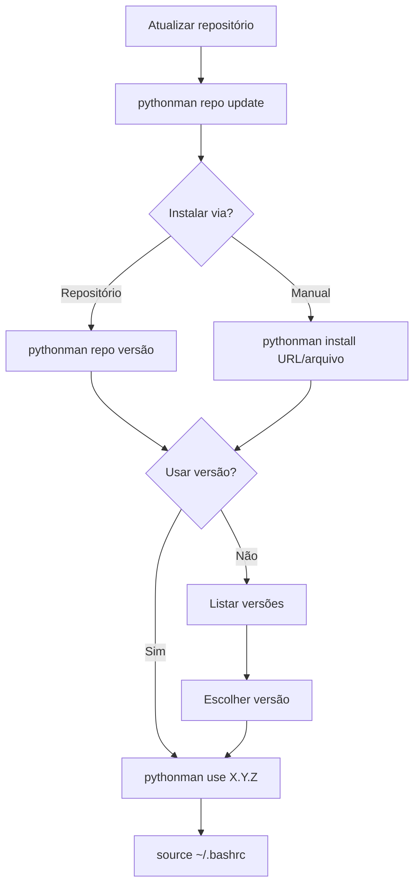

# PYTHONMAN - Python Version Manager

**Gerencie múltiplas versões do Python no Debian/AlmaLinux**  
Uma ferramenta simples para instalar, alternar e remover versões do Python sem conflitos, incluindo suporte a compilação de versões personalizadas.

## 🎯 Objetivo
Facilitar a instalação e gerenciamento de múltiplas versões do Python em sistemas baseados em Debian/Alma Linux, permitindo que desenvolvedores alternem entre versões conforme necessário para diferentes projetos, com suporte completo à compilação de versões personalizadas.

## ⚙️ Requisitos do sistema
- **Sistema Operacional**: Debian 12 (Bookworm) ou Alma Linux 9.6
- **Dependências**:
  - `wget` - Para download de arquivos
  - `tar` - Para extração de pacotes
  - `bash` - Shell para execução dos scripts
  - **Dependências de compilação** (instaladas automaticamente):
    - `build-essential` (Debian) / `Development Tools` (AlmaLinux)
    - `zlib1g-dev` / `zlib-devel`
    - `libncurses5-dev` / `ncurses-devel`
    - `libgdbm-dev` / `gdbm-devel`
    - `libnss3-dev` / `nss-devel`
    - `libssl-dev` / `openssl-devel`
    - `libreadline-dev` / `readline-devel`
    - `libffi-dev` / `libffi-devel`
    - `libsqlite3-dev` / `sqlite-devel`
    - `libbz2-dev` / `bzip2-devel`
- **Permissões**: Execução como usuário comum (não requer root)

---

## 📦 Como instalar o pythonman?

**No terminal com sua conta de usuário comum execute:**

```bash
wget -qO- https://raw.githubusercontent.com/souza-lb/pythonman/main/install | bash
```

Após a instalação, **reinicie seu terminal** ou execute:
```bash
source ~/.bashrc
```

**Nota sobre compilação:**  
O instalador irá automaticamente instalar todas as dependências necessárias para compilar versões do Python. Este processo pode demorar vários minutos.

--- 

## 📋 Comandos disponíveis

### ℹ️ Exibir ajuda
```bash
pythonman help
```

### 🔍 Listar versões instaladas
```bash
pythonman list
```

Exemplo de saída:
```
Versões Python disponíveis:
    3.9.0
--> 3.10.6
    3.11.4
```

### ⬇️ Instalar uma versão
```bash
pythonman install [URL/arquivo]
# OU via repositório:
pythonman repo [versão]
```

**Exemplos:**
```bash
# Instalar via URL oficial
pythonman install https://www.python.org/ftp/python/3.13.3/Python-3.13.3.tar.xz

# Instalar via repositório (após atualizar lista)
pythonman repo 3.13.3

# Instalar versão alpha
pythonman repo 3.14.0a7

# Instalar arquivo local
pythonman install ~/Downloads/Python-3.13.3.tar.xz
```

**Importante sobre compilação:**  
A instalação envolve compilação do código fonte, o que pode levar vários minutos dependendo do seu sistema.

### 🔄 Gerenciar Repositório de Versões

```bash
# Atualizar lista de links do repositório
pythonman repo update

# Listar versões disponíveis no repositório
pythonman repo list

# Instalar versão específica do repositório
pythonman repo [versão]
```

**Exemplos:**
```bash
# Atualizar repositório
pythonman repo update

# Listar versões disponíveis
pythonman repo list

# Instalar versão 3.13.3 do repositório
pythonman repo 3.13.3
```

Saída do `repo list`:
```
Versões disponíveis no repositório:
------------------------------------------------------------------
Versão       | Link
------------------------------------------------------------------
3.13.3       | https://www.python.org/ftp/python/3.13.3/Python-3.13.3.tar.xz
3.14.0a7     | https://www.python.org/ftp/python/3.14.0/Python-3.14.0a7.tar.xz
...
```

### ⚡ Ativar uma versão
```bash
pythonman use [versão]
```

**Exemplo:**
```bash
pythonman use 3.13.3
```

Saída:
```
Versão 3.13.3 definida como padrão!
Execute 'source ~/.bashrc' para aplicar as mudanças!
```

### 🔌 Desativar versão atual
```bash
pythonman disable
```

Saída:
```
Versão 3.13.3 desativada com sucesso!
Execute 'source ~/.bashrc' para aplicar as alterações!
```

### 🗑️ Remover uma versão
```bash
pythonman remove [versão]
```

**Exemplo:**
```bash
pythonman remove 3.9.0
```

Saída com confirmações:
```
Deseja realmente remover a versão 3.9.0? [s/N]: s
Digite o número da versão para confirmar a remoção: 3.9.0
Removendo versao: 3.9.0...
Versão 3.9.0 removida com sucesso!
```

---

## ⚙️ Estrutura de arquivos
O pythonman organiza os arquivos em:
```
~/.pythonman/
├── python_versions/     # Versões instaladas
│   ├── 3.10.6/
│   ├── 3.11.4/
│   └── current -> 3.10.6  # Link simbólico
├── link-python.txt      # Lista de links do repositório
├── log/                 # Logs de compilação
└── python_env           # Configuração de ambiente
```

## 🔄 Pós-instalação
Após usar `use` ou `disable`, sempre execute:
```bash
source ~/.bashrc
```
Para aplicar as mudanças no ambiente atual.

---

## ❌ Mensagens de erro comuns
1. **Versão já instalada:**
   ```
   Erro: A versão '3.10.6' já está instalada!
   ```

2. **Remover versão em uso:**
   ```
   Erro: A versão '3.10.6' está em uso!
   Execute: 'pythonman disable' antes de tentar remover esta versão!
   ```

3. **Versão não encontrada:**
   ```
   Erro: Versão 3.9.0 não encontrada!
   ```

4. **Formato de versão inválido:**
   ```
   Erro: Formato inválido! Use X.Y.Z[identificador]
   ```

5. **Falha na compilação:**
   ```
   Erro: Falha na compilação!
   (Verifique dependências de compilação)
   ```

6. **Repositório não encontrado:**
   ```
   Erro: Repositório não encontrado!
   Execute 'pythonman repo update' primeiro.
   ```

7. **Versão não encontrada no repositório:**
   ```
   Erro: Versão X.Y.Z não encontrada no repositório!
   ```

## ⚙️ Logs de Compilação
Todos os processos de compilação geram logs detalhados em:
```
~/.pythonman/log/
├── configure-error-warning_<timestamp>.log
├── make-error-warning_<timestamp>.log
└── install-error-warning_<timestamp>.log
```
Úteis para diagnóstico em caso de falhas na instalação.

**Nota sobre operações simultâneas:**  
O pythonman utiliza um sistema de lock para evitar múltiplas operações simultâneas. Se encontrar este erro:
```
Erro: Operação já em progresso (PID XXXX)
```
Aguarde a conclusão da operação anterior antes de tentar novamente.

---

## 🔄 Fluxo de trabalho típico



Passos detalhados:
1. **Atualizar repositório**: `pythonman repo update` (opcional, mas recomendado para instalações futuras)
2. **Instalar uma nova versão do Python**:
   - **Via repositório**: `pythonman repo [versão]`
   - **Manual**: `pythonman install [URL/arquivo]`
   - Dependências de compilação serão instaladas automaticamente
   - Código fonte será compilado localmente
3. **Decidir se deseja usar a versão imediatamente**:
   - Se sim: ativar a versão com `pythonman use X.Y.Z`
   - Se não: listar versões com `pythonman list`
4. **Para listagem de versões**:
   - Escolher uma versão específica
   - Ativar com `pythonman use X.Y.Z`
5. **Sempre após ativar/desativar**: `source ~/.bashrc`
6. **Executar aplicações Python**
7. **Quando necessário**:
   - Desativar versão atual: `pythonman disable`
   - Remover versões antigas: `pythonman remove [versão]`

---

## 🗑️ Como desinstalar?

**No terminal com sua conta de usuário comum execute:**

```bash
wget -qO- https://raw.githubusercontent.com/souza-lb/pythonman/main/uninstall | bash
```

---

## ❤️ Apoie o Projeto

**Dúvidas, sugestões e contribuições?**  
Leonardo Bruno  
souzalb@proton.me  

**Gostou do projeto e quer realizar uma contribuição voluntária?**  
*(Pode ser o valor de uma xícara de café ou chá...) ☕ 🍵*  

Chave PIX:  
`8dcc7e3c-0c6a-4c6f-a4c0-26a5e62686db`  

Ou utilize o QR Code abaixo:  

<p align="center">
  
</p>

**Você também pode utilizar o PayPal:**  

[](https://www.paypal.com/donate/?hosted_button_id=EQVW5QQ7GBGSY)

<p align="center">
  
</p>

**A utilização deste projeto é livre para alterações e adaptações**  
*Desde que feita a devida referência ao repositório original e seu criador.*
